# 📦 [SYSCARDS] - Syscards — Cartera de Crédito Directo

## Control de Documento y Auditoría

| Atributo | Detalle |
| :--- | :--- |
| **Versión Documento** | 1.2.0 (Auditoría e Integración de Protocolos) |
| **Fecha de Creación** | 2026-07-09 |
| **Fecha Última Actualización** | 2026-07-10 |
| **Documentado por** | Andy Chafla - Anthony Pambi - Pasantes de arquitectura de sistemas |
| **Revisado/Aprobado por** | Kevin Garavi - Arquitecto de Aplicaciones TI |
| **Unidad de Negocio** | Pycca (Crédito) |

---

## 1. Información General

- **Propósito:** Núcleo transaccional y operativo de escritorio que administra la emisión, mantenimiento, evaluación de riesgo, cobranza y conciliación de la tarjeta de crédito directo propia (**ClubPycca**). El sistema consolida la interacción de los ejecutivos con los datos maestros de clientes, bloqueos masivos, emisión de plásticos e integraciones con pasarelas de recaudación.
- **Criticidad:** **Tier 1 (Core Business)**. Una caída de este componente inhabilita por completo la gestión operativa de créditos, la autorización de transacciones en los puntos de venta (POS) de las tiendas físicas, las consultas de canales automáticos y los procesos de prevención de fraudes en tiempo real.
- **Contactos Clave:**
  - *Líder Técnico:* Jose Salame Atiencia
  - *Arquitecto de Aplicaciones TI:* Kevin Garavi

---

## 2. Arquitectura de Integración Detallada

Aplicación cliente/servidor monolítica basada en el entorno de desarrollo **Visual Basic 6 (Win32)**. Las terminales operativas ejecutan el binario local `SysCards.exe`, delegando la persistencia relacional a **SQL Server 2017** e interactuando de forma síncrona y asíncrona con componentes COM locales y servidores externos de seguridad de infraestructura distribuida.

```mermaid
   graph TD
    %% 1. ESTACIÓN OPERATIVA (WIN32 LEGACY)
    subgraph Estacion["Estación Operativa (Win32 Legacy CLIENT)"]
        direction TB
        MDI["MDIprincipal.frm<br/>(Menú Principal e Interfaz Operativa)"] --- LOGIN
        
        subgraph Acceso["Seguridad y Acceso"]
            LOGIN["Frmlogin.frm<br/>(Autenticación Operador)"] 
            PWD["FrmCPasswd.frm<br/>(Cambio Credenciales)"]
        end

        subgraph Modulos["Módulos Core del Sistema (SysCards.exe - VB6)"]
            direction TB
            MA["<b>Módulo A: Autorizaciones & Fraudes</b><br/>• FrmAutoriza / FrmGAutoriza<br/>• FrmAAutoConsGen<br/>• FrmAConsAlertaFraudes<br/>• FrmAIngresoFraudulententas"]
            MB["<b>Módulo B: Mantenimiento de Plásticos</b><br/>• FrmIMantGenerasPlas / FrmIConsGenerasPlas<br/>• FrmRenovaMasivaPlasticos<br/>• FrmTModificaNombrePlastico<br/>• FrmTCambioPlastico / Bin<br/>• FrmIEntregaRecepcion"]
            MC["<b>Módulo C: Recaudaciones e Integraciones</b><br/>• FrmORecaudaciones<br/>• FrmConsultaWS / WSMasivo<br/>• FrmSArchNeg / FrmSConsArchNeg"]
            MD["<b>Módulo D: Operación de Cuentas</b><br/>• FrmCambiosCliente / FrmCabioDatosCliente<br/>• FrmTCambioTelefonos / Direccion<br/>• FrmTCambioCupos / frmTCambioCicloFact<br/>• frmTBloqueoMasivo / FrmTAdicionales"]
            ME["<b>Módulo E: Procesos Batch & Cierre</b><br/>• frmAprobacionbatch<br/>• FrmSAprobacionExcep<br/>• FrmOBCalDispo (Recálculo Cupos)"]
        end

        GRID["Grillas & Reportes<br/>• FrmGrillaSensor<br/>• FrmGConsultasEnGrid<br/>• FrmVistaReporte"] --- Modulos
        
        COM["VP_AccesoDb.dll<br/>(ActiveX / COM de Acceso a Datos ADO)"]
        BUF["Buffer de Contingencia Local<br/>(C:\MoniTran\Temp\ *.txt planos)"]
    end

    %% 2. INFRAESTRUCTURA CENTRAL & MIDDLEWARE
    subgraph Servidores["Infraestructura Externa & Datacenter"]
        direction LR
        MONI["MoniTran Server (Telconet 172.30.x.x)<br/>• Validaciones Criptográficas<br/>• Gestión de Llaves<br/>• Autorizaciones POS en Tiendas"]
        WS["Middlewares Corporativos / Web Services<br/>(Sincronización Canales Digitales / Portales Web)"]
        EMB["Proveedor Externo de Embosado<br/>(Generación e Impresión Física de Plásticos)"]
        
        subgraph DB["Instancia Relacional SQL Server 2017 (172.30.1.8)"]
            NTP[("Base de Datos:<br/>NTPYCCA")]
            
            subgraph Tablas["Diccionario de Tablas Core"]
                T1["TC_MAESTRO<br/>(Cuentas, Tarjetas, Cupos, Disponibles)"]
                T2["TC_FRAUDES_ALERTAS<br/>(ID_Alerta, Tarjeta, Fecha, Estado_Alerta)"]
                T3["TC_PARAMETROS_SISTEMA<br/>(IPs, Puertos, Variables Globales)"]
                T4["TC_ESTADOS_TARJETA<br/>(Cod_Estado, Permite_Consumo BIT)"]
            end
            
            SP["SP: dbo.SP_NTS_ProcesarRecaudacionLote<br/>(Parsing, Inyección, Liquidación)"]
        end
    end

    %% 3. SERVIDOR DE DESPLIEGUE LEGACY
    subgraph Despliegue["Servidor de Distribución Binaria (172.30.1.10)"]
        SRV_EXE["SRV-SYSCARD-DC<br/>(Ruta compartida / Copia manual de SysCards.exe)"]
        CMD["regsvr32.exe VP_AccesoDb.dll<br/>(Registro local Administrador)"]
    end

    %% 4. FLUJOS DE INTERACCIÓN Y PROTOCOLOS
    MDI --- Modulos

    %% Flujos de datos dedicados por componente
    MA -->|Validación de Fraudes locales| COM
    MD -->|Actualización Cuentas| COM
    ME -->|Cierres Batch| COM
    COM -->|Consultas ADO / T-SQL Directas| NTP
    
    %% Flujos de Red Criptográfica y Contingencia
    MA -->|Sockets TCP Directos Puertos 4000-4010| MONI
    MA -->|Falla de Red: Escritura de Trazas| BUF
    BUF -.->|Conciliación Diferitada Batch| MONI

    %% Integraciones Externas
    MC -->|Consumo SOAP / REST en Tiempo Real| WS
    MC -->|1. Parsing de Archivos Planos Fijos| SP
    SP -->|2. Descuenta Saldos e Inyecta Histórico| T1
    MB -->|Exportación Segura de Tramas de Datos| EMB
    EMB -.->|Retorno Físico de Tarjetas| MB
    
    %% Flujo de Despliegue Técnico Manual
    SRV_EXE -->|Copia Manual de Binarios| Estacion
    SRV_EXE -.->|Pasos de Configuración Inicial| CMD

```



### Canal de Conectividad con MoniTran Server

La interacción con **MoniTran Server** para la validación de llaves criptográficas y autorizaciones seguras se implementa mediante un modelo híbrido:
1. **Llamadas por Sockets TCP/IP:** El ejecutable, mediante el componente ActiveX encapsulado en `VP_AccesoDb.dll`, inicializa sockets TCP directos hacia la dirección IP centralizadora de Telconet (`172.30.x.x`), operando en un rango de puertos dedicados (`4000 - 4010`) parametrizados dinámicamente según la sucursal de origen.
2. **Buffer de Contingencia Local:** En escenarios de degradación de red o procesos asíncronos diferidos, el sistema escribe de forma intermedia archivos planos de trazas transaccionales en la estructura de directorios local de la terminal (`C:\MoniTran\Temp\`) para su posterior transmisión y conciliación batch

## 3. Stack Tecnológico y Dependencias

- **Backend / Engine:** Visual Basic 6.0 (ActiveX/COM) con conectividad de datos mediante la capa ADO (Microsoft Active Data Objects).
- **Frontend:** Formularios Win32 nativos de VB6 con soporte para controles de terceros, grillas avanzadas (`FrmGrillaSensor`, `FrmGConsultasEnGrid`), menús MDI (`MDIprincipal.frm`) y visores de reportes integrados (`FrmVistaReporte`).
- **Bases de Datos:** SQL Server 2017 (bases `NTS_TARJCRED` / `NTS_MONITRAN` consolidadas bajo la instancia central `NTPYCCA`).
- **Autenticación:** Control estricto de accesos por operador (`Frmlogin.frm`) con gestión integrada de expiración y cambio de credenciales de seguridad corporativas (`FrmCPasswd.frm`).

### Inventario de Formularios Core por Módulo Técnico

#### Módulo A: Autorización y Prevención de Fraudes
* `FrmAutoriza.frm` / `FrmGAutoriza.frm` / `frmAutorizacion.frm`: Control centralizado de autorizaciones de consumos.
* `FrmAAutoConsGen.frm`: Autogeneración de parámetros de autorización.
* `FrmAConsAlertaFraudes.frm` / `FrmAIngresoFraudulententas.frm`: Monitoreo y registro de transacciones sospechosas alertadas desde el POS.

#### Módulo B: Mantenimiento y Emisión de Plásticos
* `FrmIMantGenerasPlas.frm` / `FrmIConsGenerasPlas.frm`: Definición y generación de archivos de embosado.
* `FrmRenovaMasivaPlasticos.frm`: Renovación masiva de tarjetas expiradas.
* `FrmTModificaNombrePlastico.frm`: Reemisión por cambio de datos en banda/plástico.
* `FrmTCambioPlasticoBin.frm` / `FrmTCambioPlastico.frm`: Migración de tarjetas de crédito a nuevos rangos de BIN autorizados.

#### Módulo C: Recaudación e Integración Externa
* `FrmORecaudaciones.frm`: Procesamiento, inyección y conciliación masiva de cartera externa.
* `FrmConsultaWS.frm` / `FrmConsultaWSMasivo.frm`: Consumo de web services para la sincronización de estados de cuenta con middleware periféricos.
* `FrmSArchNeg.frm` / `FrmSConsArchNeg.frm`: Bloqueo preventivo por listas negras y archivos negativos del Buró de Crédito.

#### Módulo D: Gestión de Clientes y Operación de Cuentas
* `FrmCambiosCliente.frm` / `FrmCabioDatosCliente.frm`: Mantenimiento de la ficha única de cliente.
* `FrmTCambioTelefonos.frm` / `FrmTCambioDireccion.frm`: Actualización de datos demográficos de contacto y envío de plásticos.
* `FrmTCambioCupos.frm`: Incremento/decremento de líneas de crédito aprobadas.
* `frmTCambioCicloFact.frm`: Reasignación de ciclos de corte de facturación de cuentas de crédito.
* `frmTBloqueoMasivo.frm`: Suspensión masiva de cuentas por mora o política interna.
* `FrmTAdicionales.frm`: Emisión y parametrización de cupos de tarjetas adicionales.

#### Módulo E: Procesamiento Batch y Procesos de Cierre
* `frmAprobacionbatch.frm`: Aprobación en lote de solicitudes de crédito diferidas.
* `FrmSAprobacionExcep.frm`: Registro de excepciones manuales de crédito aprobadas por la jefatura.
* `FrmOBCalDispo.frm`: Recálculo masivo del cupo disponible de clientes tras compras, recaudaciones o cobros automáticos de mora.

---

## 4. Flujos de Datos e Integraciones Críticas

### A. Integración con Canales Periféricos vía Web Services
A través de `FrmConsultaWS` y `FrmConsultaWSMasivo`, el software expone la información histórica de consumos y estados de cuenta hacia los middlewares corporativos, asegurando que los portales web y los canales digitales consulten saldos parametrizados actualizados en tiempo real.

### B. Flujo de Recaudación Externa (`FrmORecaudaciones`)
Permite la importación y liquidación de lotes de pago de la cartera provenientes de agencias bancarias y corresponsales no propietarios.
1. **Lectura de Archivo Plano:** El sistema realiza el parsing de archivos planos estructurados con longitudes de campos fijos enviados por los recaudadores externos.
2. **Validación:** Se contrastan las cabeceras del lote con las credenciales de negocio activas y códigos de banco parametrizados.
3. **Ejecución Transaccional:** El sistema invoca el Procedure de base de datos `dbo.SP_NTS_ProcesarRecaudacionLote` alojado en `NTPYCCA`. Este SP disminuye el saldo pendiente del cliente en `TC_MAESTRO`, inyecta la transacción en el histórico y libera de forma automática el cupo disponible del plástico asociado.

### C. Ciclo de Vida de Emisión de Tarjetas
El flujo estructurado por `FrmIMantGenerasPlas` &rarr; `FrmIConsGenerasPlas` &rarr; `FrmIEntregaRecepcion` automatiza la exportación segura de tramas de datos hacia la empresa embosadora externa. Posteriormente, registra la entrada física de los plásticos a la bóveda interna para controlar de manera auditable la asignación y custodia del inventario.

---

## 5. Modelo de Datos y Diccionario Ampliado

La persistencia de datos se consolida en la instancia central de SQL Server 2017 (`172.30.1.8`), en la base de datos unificada `NTPYCCA`.

### Tabla: `TC_MAESTRO` (Control de Cuentas y Límites de Crédito)
| Campo | Tipo de Dato | Obligatorio | Descripción / Reglas de Negocio Estrictas |
| :--- | :--- | :--- | :--- |
| `CUENTA` | `VARCHAR(10)` | Sí | Identificador único de cuenta de crédito (máscara fija de visualización `999999999`). |
| `TARJETA` | `VARCHAR(16)` | Sí | Número de tarjeta de crédito principal asociada a la cuenta (PAN). |
| `CUPOS` | `DECIMAL(18,2)` | Sí | Límite total de crédito aprobado para consumos de la cuenta. |
| `DISPONIBLE` | `DECIMAL(18,2)` | Sí | Saldo disponible recalculado de forma dinámica por `FrmOBCalDispo` tras compras o cobros masivos. |

### Tabla: `TC_FRAUDES_ALERTAS` (Monitoreo de Transacciones y Seguridad)
| Campo | Tipo de Dato | Obligatorio | Descripción / Reglas de Negocio Estrictas |
| :--- | :--- | :--- | :--- |
| `ID_ALERTA` | `NUMERIC(10)` | Sí | Identificador secuencial autoincremental de la alerta de fraude. |
| `TARJETA` | `VARCHAR(16)` | Sí | Número de tarjeta de crédito analizada/observada (`FrmAConsAlertaFraudes`). |
| `FECHA_ALERTA` | `DATETIME` | Sí | Estampa de tiempo exacta en que se generó la sospecha transaccional. |
| `ESTADO_ALERTA` | `VARCHAR(3)` | Sí | Estado de la alerta (`PEN` = Pendiente, `DES` = Descartada, `BLO` = Confirmada con Bloqueo de Plástico). |

### Tabla: `TC_PARAMETROS_SISTEMA` (Configuración de Red y Reglas Globales)
| Campo | Tipo de Dato | Obligatorio | Descripción / Reglas de Negocio Estrictas |
| :--- | :--- | :--- | :--- |
| `COD_PARAMETRO` | `VARCHAR(10)` | Sí | Código de la variable global del sistema (ej. `IP_MONITRAN`, `PORT_MONI`, `PATH_TEMP`). |
| `VALOR_STR` | `VARCHAR(250)` | No | Valor asignado de tipo texto (IPs de conexión, directorios físicos, etc.). |
| `VALOR_NUM` | `DECIMAL(18,4)` | No | Parámetros numéricos (puertos de sockets, tiempos límite de sesión, etc.). |
| `DESCRIPCION` | `VARCHAR(150)` | Sí | Glosa descriptiva para la administración técnica del sistema. |

### Tabla: `TC_ESTADOS_TARJETA` (Estados Operativos de los Plásticos)
| Campo | Tipo de Dato | Obligatorio | Descripción / Reglas de Negocio Estrictas |
| :--- | :--- | :--- | :--- |
| `COD_ESTADO` | `VARCHAR(3)` | Sí | Clave primaria del estado de la tarjeta (ej. `ACT` - Activa, `BLO` - Bloqueada, `FRA` - Fraude). |
| `DESCRIPCION` | `VARCHAR(50)` | Sí | Nombre representativo del estado (Activa, Bloqueada, Fraude, Cancelada). |
| `PERMITE_CONSUMO` | `BIT` | Sí | Bandera lógica que determina si el POS autoriza compras en línea (`1` = Sí, `0` = No). |

---

## 6. Infraestructura y Despliegue (Enfoque Legacy)

El ciclo de puesta en producción depende de un entorno heredado basado en tareas manuales:

### Paso a Paso de Despliegue en Servidores y Estaciones

1. **Preparación del Entorno de Desarrollo:** Cargar las dependencias locales y abrir el espacio de trabajo del proyecto a través del IDE con el archivo de solución `SysCards.vbp`.
2. **Generación del Binario:** Compilar la aplicación desde el IDE de Visual Basic 6.0 para empaquetar de forma íntegra todos los formularios (`.frm`) actualizados en el ejecutable Win32 compilado nativamente (`SysCards.exe`).
3. **Despliegue Físico:** Reemplazar y copiar manualmente el binario compilado hacia la ruta de red compartida o carpetas locales en los terminales de créditos (`SRV-SYSCARD-DC` / `172.30.1.10`).
4. **Registro de Componentes COM:** En caso de haberse actualizado la capa de acceso a datos o la lógica distribuida en `VP_AccesoDb.dll`, es obligatorio registrarla en las estaciones utilizando la consola de comandos de Windows (CMD con privilegios de Administrador):
   ```cmd
   regsvr32.exe C:\RutaDeLibrerias\VP_AccesoDb.dll
   ```

## 7. Operación, Soporte y Mitigación de Riesgos

### Runbook de Troubleshooting (Operación y Soporte)

#### Escenario 1: Errores o Excepciones de Bloqueo en Cargas Masivas de Recaudaciones
* **Problema:** El módulo `FrmORecaudaciones` emite un error en tiempo de ejecución (Runtime) y no inyecta los lotes de corresponsales bancarios.
* **Acción:** 1. Validar la consistencia estructural y de cabeceras del archivo plano de recaudación según los parámetros cargados en `TC_PARAMETROS_SISTEMA`.
  2. Monitorear los tiempos de respuesta y posibles bloqueos de tablas (*deadlocks*) del procedimiento almacenado `dbo.SP_NTS_ProcesarRecaudacionLote` en la base relacional central.
  3. Comprobar la disponibilidad del pool de conexiones ADO contra el servidor de base de datos `172.30.1.8`.

#### Escenario 2: Fallas de Conexión en Tiempo Real con MoniTran Server
* **Problema:** Syscards no procesa aprobaciones de crédito o no valida autorizaciones locales y emite errores criptográficos.
* **Acción:**
  1. Verificar la apertura de los puertos de red en el rango `4000 - 4010` en el firewall perimetral hacia la IP del Datacenter de Telconet (`172.30.x.x`).
  2. Validar que la estación operativa del operador tenga permisos de escritura locales habilitados en el directorio `C:\MoniTran\Temp\`.
  3. Purgar archivos corruptos o tramas de longitud errónea en la cola local que puedan estar ocasionando excepciones por desbordamiento de memoria.

### Deuda Técnica Identificada

1. **Acoplamiento de Reglas de Negocio en la Interfaz (UI):** Lógicas medulares del core, tales como las rutinas de bloqueo masivo (`frmTBloqueoMasivo`) y la evaluación estricta en base al archivo negativo del buró (`FrmSArchNeg.frm`), residen directamente dentro de los eventos internos de la UI en VB6, impidiendo la reutilización de código y limitando la agilidad para canales modernos.
2. **Dependencia de Infraestructura de 32 Bits:** El uso nativo de librerías COM ActiveX registradas manualmente en el sistema operativo incrementa de forma exponencial los riesgos de inestabilidad tecnológica ante la obsolescencia de plataformas de hardware y sistemas operativos modernos de 64 bits en las estaciones operativas.

### Ruta de Migración Sugerida

Se recomienda establecer una estrategia de desacoplamiento prioritario enfocada en la sustitución progresiva de formularios críticos por microservicios modernos:
- **Prioridad 1 (Corto Plazo):** Desacoplar las interfaces de validación de fraudes (`FrmAConsAlertaFraudes.frm`) e inyección de recaudaciones externas (`FrmORecaudaciones.frm`) migrando la lógica transaccional a servicios independientes desarrollados en .NET Core o Node.js.
- **Prioridad 2 (Mediano Plazo):** Exponer de forma unificada la parametrización global del sistema y los estados operativos de las cuentas de crédito mediante APIs REST que consuman de manera segura los datos de la instancia relacional.
- **Prioridad 3 (Largo Plazo):** Retirar y apagar de manera definitiva el binario cliente `SysCards.exe` una vez implementado el frontend web unificado.